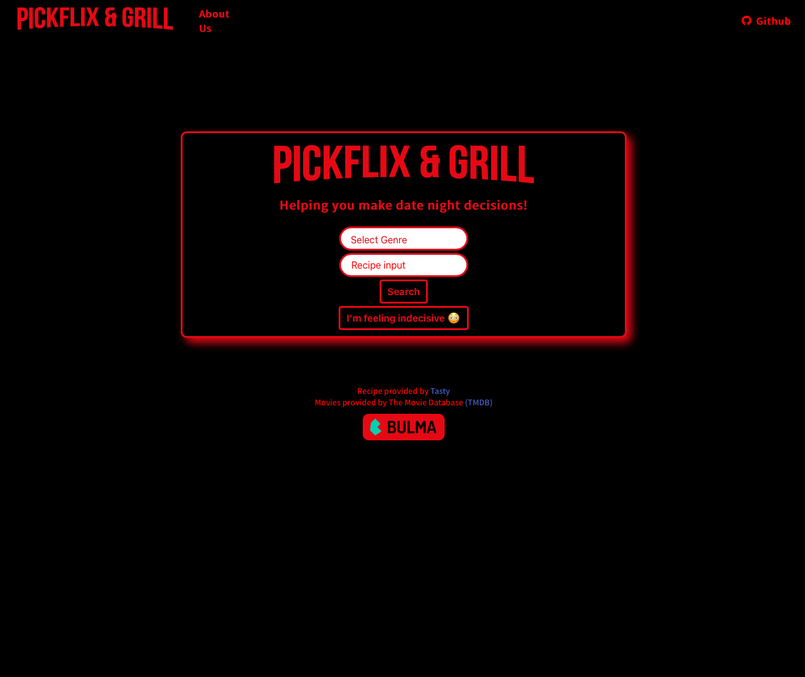
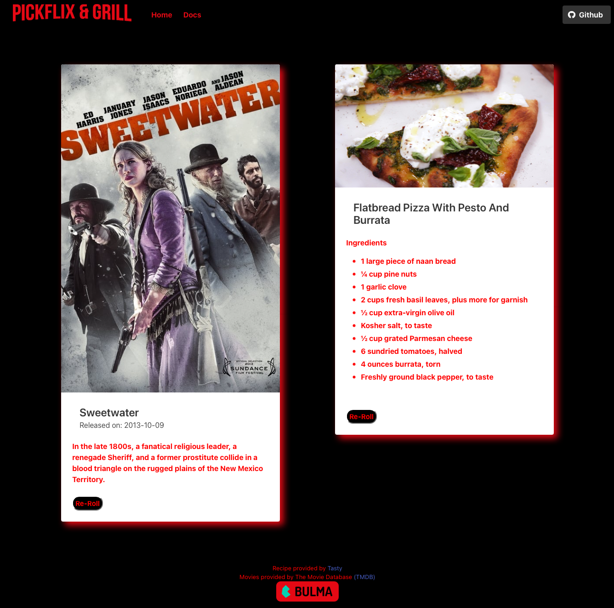

# group-3
Project 1 - Pickflix & Grill
 
 
Group 3 has created Pickflix & Grill, a movie and recipe generator that takes input from the user in the form of a movie genre and a recipe ingredient, and makes home date night decisions easier in a couple of clicks by accessing two server-side API's.
 
 
Link to live deployed app:  https://cnvives.github.io/group-3/

## Purpose
We can all be indecisisive from time to time.  Making dinner and movie decisions can be especially difficult.  That is why we have created Pickflix & Grill!  With this web application, a user can choose a genre of movie they would like to watch along with a recipe ingredient they currently have at home, and they will be provided with a movie recommendation and a recipe that can be made in under 30 minutes!

## Technologies used
This project was coded using JavaScript, HTML, and CSS.  Bulma was used as the underlying framework.  We have created this application to access The Movie Database (TMDB) API for movies and the Tasty API for recipes.

## Example images

## License
[MIT](https://choosealicense.com/licenses/mit/)
 

## Contact the contributors
Harrison Kidd  
harrisonakidd@gmail.com
 
Zhansaya Sarmanova  
zhansayasarmanova1993@gmail.com 
 
Einstein Dalmau  
enty84@gmail.com  
Cas Vives-Petralia  
cnvives@gmail.com  

